```mermaid
graph TD;
    subgraph Data Cropping;
    A["DataLoad (Loading of full dataset, or of a single patient)"] --> B["BedRemoval (Removal of the bed, which may alter the bounding box)"];
    B["BedRemoval (Removal of the bed, which may alter the bounding box)"]--> C["Halve (From each image is conserved only the Right of Left part)"];
    C["Halve (From each image is conserved only the Right of Left part)"]--> D["Thresholding (Binary thresholding)"];
    D["Thresholding (Binary thresholding)"]--> E["BoundingBox (Bounding box for each slice, for each volume image)"];
    E["BoundingBox (Bounding box for each slice, for each volume image)"]--> F["Crop (For each slice a (256,256) patch, centered about the center of the bounding box)"];
    G["Thresholding(256,512,Depth)"]--> F["Crop(256,256,Depth)"];
    F["Crop (For each slice a (256,256) patch, centered about the center of the bounding box)"]-->I["Written to memory (default is write_to_folder = False)"];
    F["Crop (For each slice a (256,256) patch, centered about the center of the bounding box)"]-->H["Written to a folder (write_to_folder = True)"];
    end;
    subgraph Bone Reconstruction;
    L["DataLoad (Loading of full dataset, or of a single patient)"] --> M["Reconstruction (Stacking and alignment of previously cropped (and misaligned) slices from the images)"];
    N["CSV Reader (reading of previously stored list of bounding boxes"] --> M["Reconstruction (Stacking and alignment of previously cropped (and misaligned) slices from the images)"];
    M["Reconstruction (Stacking and alignment of previously cropped (and misaligned) slices from the images)"] --> O["NIFTISampleWriter (Reconstructed image is written in a NIFTI file at the desired Path )"];
    end;
```

```mermaid
graph TD;
    subgraph Train;
    A["DataLoad (Loading of full dataset, or of a single patient)"] --> B["StackedData (Unpacking of the input volume images. The slices composing them are stacked together)"];
    B["StackedData (Unpacking of the input volume images. The slices composing them are stacked together)"] --> C["NormDict (Normalization in the range [0,1] of the pixels composing the slices"];
    C["NormDict (Normalization in the range [0,1] of the pixels composing the slices"] --> D["Split (Splitting of the stacked dataset into Train, Validation and Test sets)"];
     D["Split (Splitting of the stacked dataset into Train, Validation and Test sets)"] --> E["ImageFeeder (class inheriting from tf.keras.sequence for data feeding)"];
     E["ImageFeeder (class inheriting from tf.keras.sequence for data feeding"] --> F["Unet fitting"];
     G["dice_coef, dice_loss"] --> F["Unet fitting"];
     F["Unet fitting"] --> H["Model and Callbacks saving"];
    end;
    subgraph Predict
    I["DataLoad (Loading of full dataset, or of a single patient)"] --> L["StackedData (Unpacking of the input volume images. The slices composing them are stacked together)"];
    L["StackedData (Unpacking of the input volume images. The slices composing them are stacked together)"] --> M["PredictionDataFeeder (class inheriting from tf.keras.sequence for data feeding)"];
    M["PredictionDataFeeder (class inheriting from tf.keras.sequence for data feeding)"] --> N["Unet predict"];
    O["dice_coef, dice_loss"] --> N["Unet predict"];
    N["Unet predict"] --> P["display_mask (prediction slices are displayed"];
    N["Unet predict"] --> Q["NIFTISampleWriter (predicted segmentations ar written in the desired path)"];
    end
```

# Unet Single-Femur Segmentation
This package provides an end-to-end pipeline, working with 3D CT scans, both for the training of the designed Neural Netork architecture and for the prediction on new data. The predicted segmentation can also be extracted and written to a NIFTI file.
## Overview
The particularity of this implemantetion of Semantic Segmentation is that the package is designed to predict the shapes of single femurs: this mandatory requirement 
entails some workarounds in the pre\post-processing of the data to be fed to the network. A flow-chart of the various workflows is provided in the [Workflows](#workflows) section.
## Requirements
There are some requirements to be satisfied for the correct functioning of the package, both in package dependencies, in folder structure for the data and in the naming of the subfolders representing the patients. 
### Dependencies 
### Folder Structure
### Subfolders Naming
Folders identifying the patients, which contain the subfolders with the images and the segmentations, **must contain _R_ or _L_** in the name, so that the leg of which the label is present is known to the algorithm. 
The subfolders, for each patient, must contain **_Data_** and **_Segmentation_** (or **_Segmentations_**) in the corresponding name.
# Workflows
## Pre and Post Processing Workflows

## Pre and Post Processing Workflows

