# Unet Single-Femur Segmentation

* [Overview](#overview)
* [Some Results](#some-results)
* [UNet](#unet)
* [Requirements](#requirements)
* [Dependencies](#dependencies)
* [Folder Structure](#folder-structure)
* [Subfolders Naming](#subfolders-naming)
* [Installing](#installing)
* [Working with 2DUnetFemurSegmentation](#working-with-2dunetfemursegmentation)
* [Workflows](#workflows)

## Overview

This package provides an end-to-end pipeline, working with 3D CT scans, both for the training of the designed Neural Netork architecture and for the prediction on new data. The predicted segmentation can also be extracted and written to a NIFTI file.
It tackles the task by working on a decomposition in 2D slices of the original volume image, both for the pre\postprocessing and training\prediction, going back to a 3D volume image by means of a reconstruction pipeline.

It's possible to work with various image formats in input, namely:
* NIFTI;
* Nrrd;
* DICOM;

The particularity of this implementation of Semantic Segmentation is that the package is designed to predict the shapes of single femurs: this mandatory requirement 
entails some workarounds in the pre\post-processing of the data to be fed to the network. 

Fully Convolutional Neural Networks (FCN) require squared input images, with side sizes following $log_2$ scale, to work at their best. 
In order to achieve that data format, the preprocessing pipeline takes care of splitting the volume image in half, identifying where the femur we want to work on is located, to then obtain -slice by slice- a (256,256) patch centered about the center of the bounding box.
The latter one is obtained from a binary thresholding on the image where the bed has already been removed, with which we select the area of interest for our task.
The center of this region is then used to cut the patch, with a cross range $\pm 128$ on _x_ and _y_ axes.
Once obtained those patches along the depth of each volume image, those are stacked un together in a new (256,256,depth) volume, which can be written in a new data folder with the structure designed as in the [Folder Structure](#folder_structure) subsection.


Once the prediction phase is ended (or the training phase in case the objective is to train the network) and the resulting segmentation is written to the desired folder, the result is a volume image of misaligned 2D slices. Hence the bone_reconstruction module can be used to reconstruct the original shape of the femur:
it does so by taking the predicted volume and realigning its slices following the indication on where the bounding boxes were placed on the original image, stacking them together in a new volume. 

**Notes:** 

* It is **__required__** that even the original folder containing the data with which one is working with follows the same structure;
* The cropping operated by data_pipeline.py writes a .txt file (in the arguments upon calling the script the user must write the name of the new file with the .txt extension), in the folder where the original data is stored, with the positions of the bounding box veritces;
* prediction.py writes a .txt file (with the request as above) where the metadata of the image fed to it are stored; 

A flowchart of the various workflows is provided in the [Workflows](#workflows) section.

## Some Results


Those results were obtained with the provided UNet, with parameters and specifics as follows:
* Batch Size : 20;
* Learning Rate : 0.001;
* Epochs : 90;
* Dataset Split : 85% (train), 10% (validation), 5% (test);
* Optimizer : Adam;
* Metric : Dice Coefficient;
* Loss Function : Dice Coefficient Loss.

_Please Note_ : This isn't by any means a completed project, so there's a lot to room for imporoving the results obtained (The original CT for which this label was obtained had a disjoint location along the bone, which is then transported to this segmentation)

## UNet 


## Requirements
There are some requirements to be satisfied for the correct functioning of the package, both in package dependencies, in folder structure for the data and in the naming of the subfolders representing the patients. 
The provided Unet architecture works only with (256,256,depth) shaped volumes.

### Dependencies 
* numpy;
* SimpleITK;
* hypothesis;
* pytest;
* tensorflow >= 2.6.0.
### Folder Structure
```
DataFolder
    ├── patient01
    │   ├── patient01Data
    |   |       |
    |   |       └──NIFTI/Nrrd file or DICOM sequence
    │   └── patient01Segmentations
    |   |       |
    |   |       └──NIFTI/Nrrd file or DICOM sequence
    ├── patient02
    │   ├── patient02Data
    |   |       |
    |   |       └──NIFTI/Nrrd file or DICOM sequence
    │   └── patient02Segmentations
    |   |       |
    |   |       └──NIFTI/Nrrd file or DICOM sequence
    .
    .
    .
 ```
### Subfolders Naming
Folders identifying the patients, which contain the subfolders with the images and the segmentations, **must contain _R_ or _L_** in the name, so that the leg of which the label is present is known to the algorithm. 
The subfolders, for each patient, must contain **_Data_** and **_Segmentation_** in the corresponding name.

## Installing


## Working with 2DUnetFemurSegmentation
This package is composed of multiple segments (as briefly explained in the [Overview](#overview) section) which allow for different kind of operations on the dataset under exam.
The overall goal is twofold: to train a _FCN_ but mainly to be able to obtain a segmentation of the input femur CT, given an already trained _FCN_.
Data input pipeline is shared among the training and the prediction tasks, so we'll make a distinction only when it'll come in handy.

```shell
user@machine:~$ python path_to_file\data_pipeline.py path_to_data_folder path_to_folder_cropped_images low_threshold high_threshold True True --bbox_csv=path_to_bbox_txt --metadata_csv=path_to_metadata_txt
```
With this command the cropped dataset will be written to the path_to_folder_cropped_images while a txt file, named as the last part of path_to_bbox_csv, with the corresponding bounding boxe's coordinates, is written at the choosen path. At the same time, a txt file containing in each row the spacing and the origin of the original images is written in the choosen destination. It will proof useful during the reconstruction process.

### Training
```shell
user@machine:~$ python path_to_file\train.py path_to_data_folder (256,256) train_split validation_split test_split batch_size epochs path_to_callbacks path_to_save_model\model_name
```

### Predicting
```shell
user@machine:~$ python path_to_file\prediction.py path_to_data_folder path_to_trained_network True batch_size --new_folder_path path_to_new_folder
```


```shell
user@machine:~$ python path_to_file\bonereconstruction.py path_to_data_folder path_to_new_folder False path_to_bbox_txt path_to_metadata_txt
```


# Workflows
## Pre and Post Processing Workflows

## Training and Prediction Workflows

```mermaid
graph TD;
    subgraph Train;
    A["DataLoad (Loading of full dataset, or of a single patient)"] --> B["StackedData (Unpacking of the input volume images. The slices composing them are stacked together)"];
    B["StackedData (Unpacking of the input volume images. The slices composing them are stacked together)"] --> C["NormDict (Normalization in the range [0,1] of the pixels composing the slices"];
    C["NormDict (Normalization in the range [0,1] of the pixels composing the slices"] --> D["Split (Splitting of the stacked dataset into Train, Validation and Test sets)"];
     D["Split (Splitting of the stacked dataset into Train, Validation and Test sets)"] --> E["ImageFeeder (class inheriting from tf.keras.sequence for data feeding)"];
     E["ImageFeeder (class inheriting from tf.keras.sequence for data feeding"] --> F["Unet fitting"];
     G["dice_coef, dice_loss"] --> F["Unet fitting"];
     F["Unet fitting"] --> H["Model and Callbacks saving"];
    end;
    subgraph Predict
    I["DataLoad (Loading of full dataset, or of a single patient)"] --> L["StackedData (Unpacking of the input volume images. The slices composing them are stacked together)"];
    L["StackedData (Unpacking of the input volume images. The slices composing them are stacked together)"] --> M["PredictionDataFeeder (class inheriting from tf.keras.sequence for data feeding)"];
    M["PredictionDataFeeder (class inheriting from tf.keras.sequence for data feeding)"] --> N["Unet predict"];
    O["dice_coef, dice_loss"] --> N["Unet predict"];
    N["Unet predict"] --> P["NIFTISampleWriter (predicted segmentations are written in the desired path)"];
    end
```


